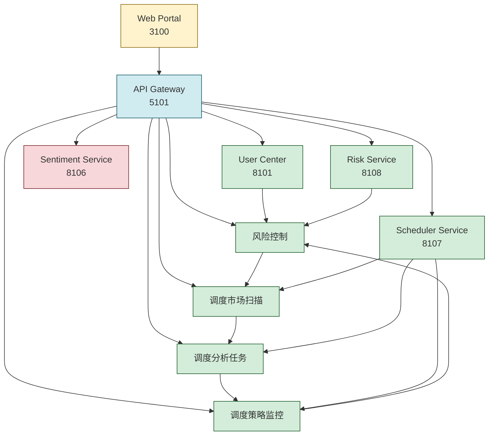

# 架构概览

## 服务列表

根据 `docs/service-map.yaml` 和 `docs/phase1-stack.md`，当前系统包含以下服务：

| 服务名称 | 端口 | 状态 | 主要职责 |
|----------|------|------|----------|
| web-portal | 3100 | 已运行 | 统一用户界面、路由编排、图表和分析视图 |
| api-gateway | 5101 | 已运行 | 认证聚合、服务路由、统一响应包装 |
| user-center | 8101 | 已运行 | 登录、个人资料、监单列表、用户偏好 |
| market-service | 8102 | 已运行 | 市场宇宙、价格历史、指标快照、市场扫描数据集 |
| analysis-service | 8103 | 已运行 | AI分析、趋势批量扫描、结论生成 |
| strategy-service | 8104 | 已运行 | 策略配置、风险规则协调、回测编排 |
| trade-service | 8105 | 已运行 | 订单执行、持仓查询、订单投射 |
| sentiment-service | 8106 | 占位中 | 情感摄取、情感评分、事件提取、标的情感摘要 |
| scheduler-service | 8107 | 已落地 | 线程状态/任务策略/执行记录 |
| risk-service | 8108 | 已落地 | 风控总览/保护单/通知中心 |

## 服务交互关系

## 最近重构方向与计划

最近一轮重构重点不在新增业务功能，而在先清理运行时隐式依赖和交易遗留单体结构，当前主线包括：

- 拆掉总兼容适配器，改为 `service_boundaries/` 分域边界
- 去掉 `shared/bootstrap.py` 对旧目录的全局 `sys.path` 注入，改为显式根级兼容包入口
- 把 `trade-service` 从动态文件加载切到显式 `legacy_trade_service/` 包
- 继续把 `legacy_trade_service/main.py` 往共享模型、`outbox/saga`、账户订单视图三个方向拆薄
- 已把提交/撤单命令编排从 `legacy_trade_service/main.py` 迁到 `legacy_trade_service/trade_commands.py`
- 已进一步把提交流程与撤单流程分流到 `legacy_trade_service/trade_submit_flow.py` 与 `legacy_trade_service/trade_cancel_flow.py`
- `legacy_trade_service/trade_commands.py` 当前退化为公共 helper 与兼容导出层
- `apps/trade-service/src/main.py` 已开始直接复用 `legacy_trade_service/account_views.py` 提供的账户状态与订单读取能力
- `trade_order_projections` 的 schema 与索引补齐当前统一归属在 `legacy_trade_service/outbox.py`
- 为后续前端平台壳层、视角、角色权限和菜单编排打基础

集中汇总文档：

- [recent-refactor-direction-and-plan.md](/Users/lusd/Documents/New project/refactor-v2/docs/recent-refactor-direction-and-plan.md)

当前直接相关的实施计划：

- [2026-03-27-legacy-compat-domain-split.md](/Users/lusd/Documents/New project/refactor-v2/docs/superpowers/plans/2026-03-27-legacy-compat-domain-split.md)
- [2026-03-27-bootstrap-explicit-legacy-packages.md](/Users/lusd/Documents/New project/refactor-v2/docs/superpowers/plans/2026-03-27-bootstrap-explicit-legacy-packages.md)
- [2026-03-27-trade-runtime-explicit-package.md](/Users/lusd/Documents/New project/refactor-v2/docs/superpowers/plans/2026-03-27-trade-runtime-explicit-package.md)
- [2026-03-27-trade-runtime-internal-module-split.md](/Users/lusd/Documents/New project/refactor-v2/docs/superpowers/plans/2026-03-27-trade-runtime-internal-module-split.md)
- [2026-03-28-trade-command-orchestration-split.md](/Users/lusd/Documents/New project/refactor-v2/docs/superpowers/plans/2026-03-28-trade-command-orchestration-split.md)
- [2026-03-28-trade-command-hardening-and-split.md](/Users/lusd/Documents/New project/refactor-v2/docs/superpowers/plans/2026-03-28-trade-command-hardening-and-split.md)
- [2026-03-28-trade-service-duplicate-helper-consolidation.md](/Users/lusd/Documents/New project/refactor-v2/docs/superpowers/plans/2026-03-28-trade-service-duplicate-helper-consolidation.md)
- [2026-03-27-platform-shell-view-permission-foundation.md](/Users/lusd/Documents/New project/refactor-v2/docs/superpowers/plans/2026-03-27-platform-shell-view-permission-foundation.md)
- [2026-03-27-core-workspace-shell-refresh.md](/Users/lusd/Documents/New project/refactor-v2/docs/superpowers/plans/2026-03-27-core-workspace-shell-refresh.md)
