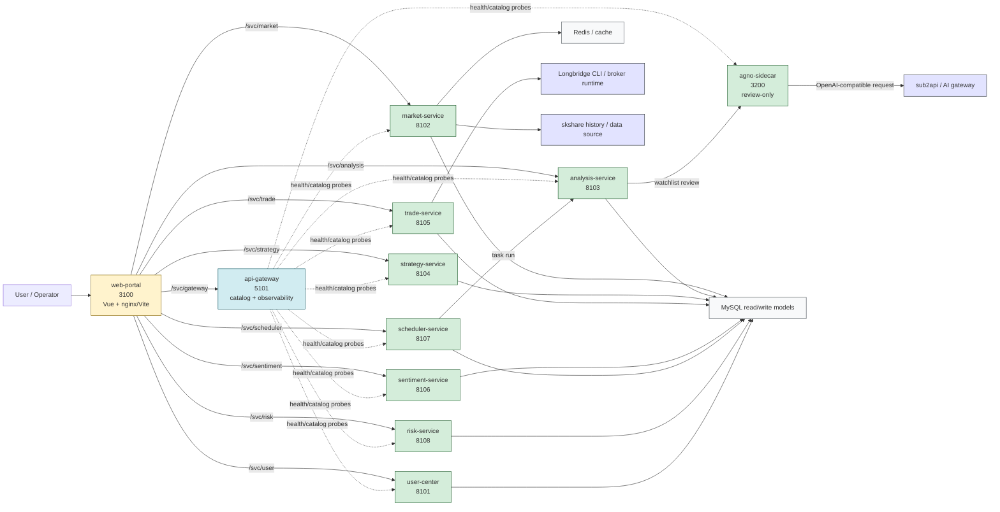
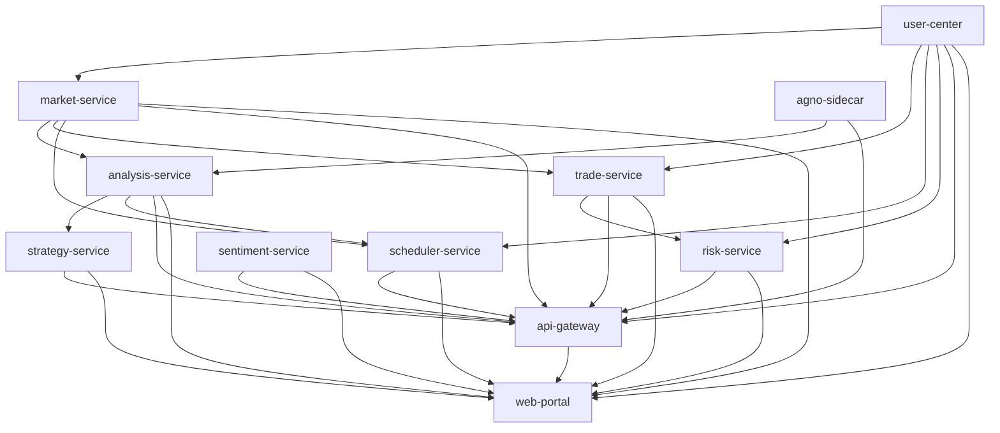
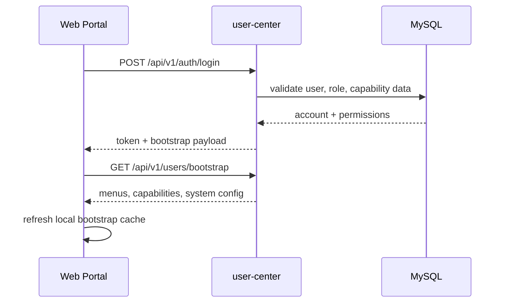
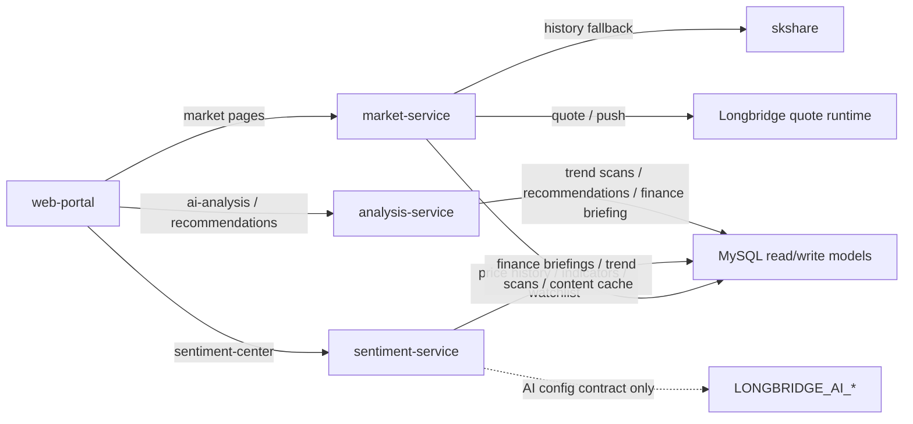
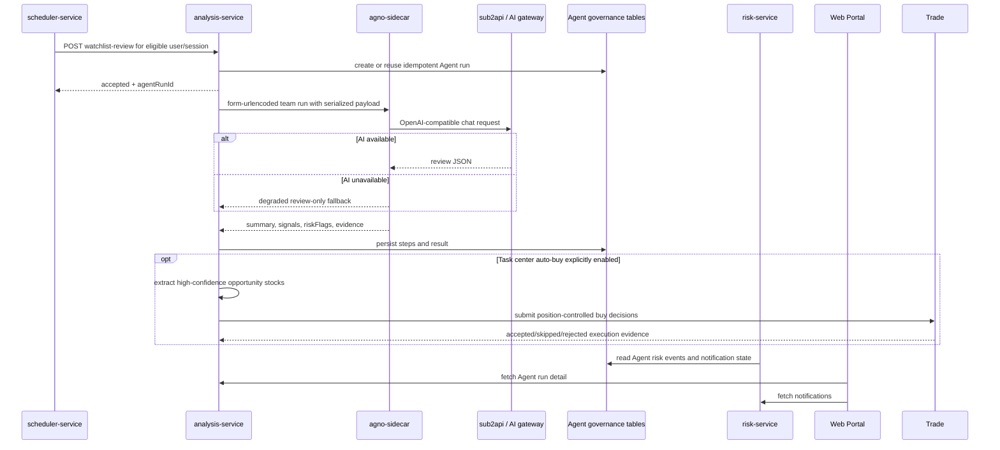
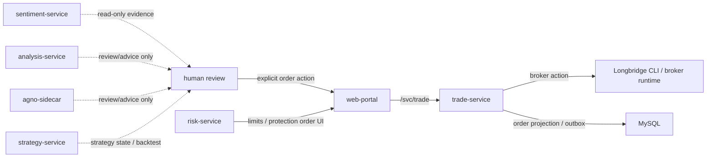
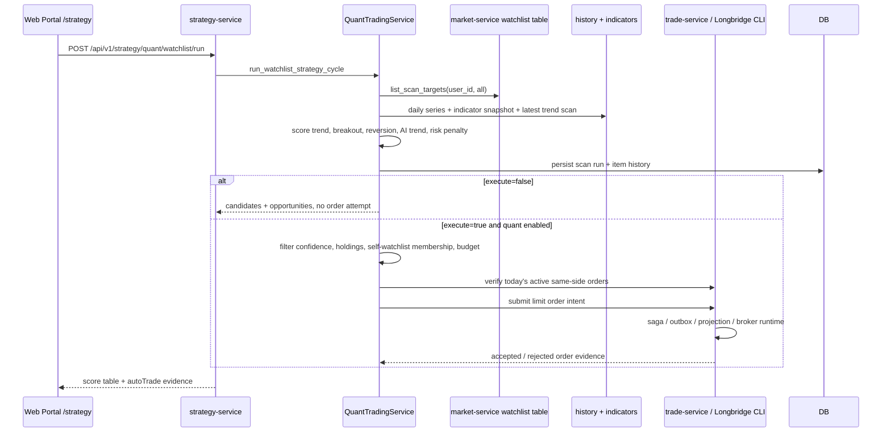
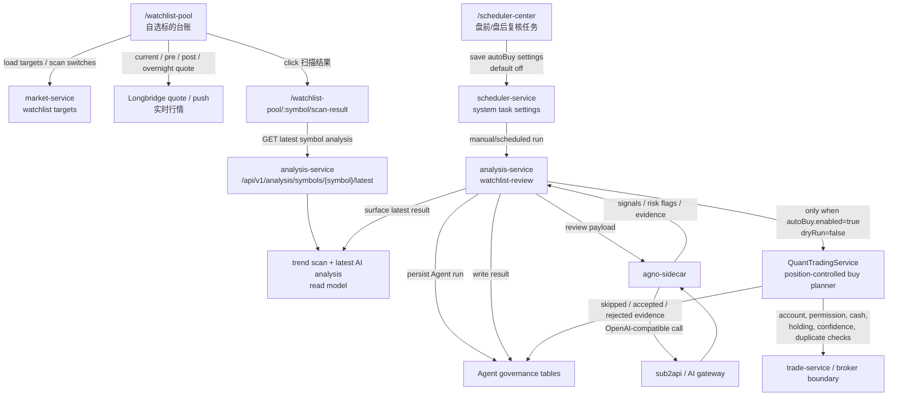
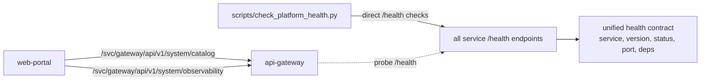

# System Architecture And Linkage

Date: 2026-05-21

This document is the current architecture map for Refactor V2. It focuses on the running service topology, each microservice boundary, and the way product flows move across services.

## Source Of Truth

- Runtime topology: `docker-compose.yml`
- Frontend proxy topology: `apps/frontend/web-portal/nginx.conf`, `apps/frontend/web-portal/vite.config.js`
- Service catalog and dependency probes: `apps/platform/api-gateway/src/main.py`
- Local lifecycle: `scripts/start_phase1_stack.sh`, `scripts/stop_phase1_stack.sh`, `scripts/check_platform_health.py`
- Structured service inventory: `docs/service-map.yaml`
- Recent verification point: 2026-05-21, `python3 -m py_compile backend-server/src/core/analysis/QuantTradingService.py apps/intelligence/strategy-service/src/main.py`; `.venv/bin/python -m pytest -q tests/python/test_watchlist_quant_strategy.py`; `npm --prefix apps/frontend/web-portal run test:unit -- market-shell-pages.spec.js`

## Overall Topology

Key point: `api-gateway` is not the business reverse proxy. Web Portal owns the `/svc/*` routing layer. Gateway owns service catalog, dependency probes, and observability endpoints.

## Microservice Boundaries

| Service | Port | Main Function | Primary Inbound | Important Outbound / Dependencies | Safety Notes |
| --- | --- | --- | --- | --- | --- |
| `web-portal` | `3100` | Unified workbench, routing, charts, mobile/desktop shells | Browser / local app | Direct `/svc/*` proxy to services | Does not execute trades directly |
| `user-center` | `8101` | Login, JWT/session, user bootstrap, roles, menus, settings | `/svc/user/...` | MySQL, platform access service | Defines capability surface for pages |
| `market-service` | `8102` | Market universe, quotes, stock pool, watchlist, history, longbridge push | `/svc/market/...` | MySQL, Redis, skshare, Longbridge quote/push | Market data only; no order execution |
| `analysis-service` | `8103` | AI analysis, trend scans, recommendations, finance briefings, Agent run governance | `/svc/analysis/...`, scheduler calls | MySQL, `agno-sidecar`, AI config | Review and evidence only |
| `strategy-service` | `8104` | Strategy CRUD, backtest, monitor summary, self-watchlist quant scan | `/svc/strategy/...` | MySQL, market watchlist/history, analysis outputs | Strategy scan is preview-first; controlled execution still passes quant/trade safety gates |
| `trade-service` | `8105` | Broker accounts, assets, positions, orders, outbox/saga | `/svc/trade/...` | MySQL, Longbridge CLI/runtime, market reads | Only service allowed to write trade execution state |
| `sentiment-service` | `8106` | Sentiment center read model, GitHub reference metadata, quant-consumable sentiment fields | `/svc/sentiment/...` | MySQL read-model helpers, `LONGBRIDGE_AI_*` config contract | Read-only evidence; no strategy or trade trigger |
| `scheduler-service` | `8107` | System tasks, runtime state, manual task runs, watchlist review orchestration | `/svc/scheduler/...`, background jobs | MySQL, analysis-service | Orchestrates review work but does not call broker |
| `risk-service` | `8108` | Risk overview, limits, protection orders, notifications, Agent risk event projection | `/svc/risk/...` | MySQL, legacy risk helpers, Agent run read models | Risk controls and notifications; no hidden broker bypass |
| `api-gateway` | `5101` | Service catalog, dependency health, observability summary | `/svc/gateway/...`, direct `5101/api/v1/...` | Probes downstream `/health` | Not currently a business API forwarding layer |
| `agno-sidecar` | `3200` | Agno-compatible watchlist review, AI gateway call, degraded fallback | analysis-service, direct smoke calls | `LONGBRIDGE_AI_URL`, `sub2api` | Strictly review-only |

## Runtime Startup Graph

Docker compose starts every listed service when run without a service filter. Local script mode starts the main Phase 1 stack and only starts `sentiment-service` when `REF_SENTIMENT_ENABLED=true`.

## Product Flow Diagrams

### Login, Bootstrap, Menus

### Market, Sentiment, Analysis Read Models

The current split is intentionally read-model heavy. Sentiment consumes existing evidence and exposes quant-readable fields; it does not trigger strategy execution.

### Quant Strategy GitHub Pattern Adoption

The quant strategy work borrows ideas from Lean, Qlib, vn.py, and PyPortfolioOpt without vendoring their code or introducing their full runtime stacks:

- Lean informs the event pipeline and normalized order lifecycle.
- Qlib informs factor-driven scoring and the separation between research output and runtime signals.
- vn.py informs the separation between strategy logic, risk checks, and execution boundary.
- PyPortfolioOpt informs lightweight position-budget thinking, not a separate optimizer service.

Those ideas map onto the current architecture like this:

| Pattern | Current boundary | What is used here | What is not used here |
| --- | --- | --- | --- |
| Event pipeline | `strategy-service` | Multi-factor scan, backtest, preview-first opportunity generation | Full Lean runtime |
| Factor scoring | `strategy-service` and `analysis-service` | Strategy scoring can reuse analysis outputs and market history | Heavy external factor library |
| Risk gate | `risk-service` and `trade-service` | Existing permission, cash, duplicate, and position checks still gate execution | Direct broker writes from analysis or strategy |
| Position budget | `strategy-service` | Per-run and per-symbol sizing limits for self-watchlist execution | Portfolio optimizer service |

If a future change needs a real optimizer, a richer factor registry, or a formal event bus, that should be captured in a new ADR before the implementation changes.

### Watchlist Review And Human Governance

### Trade Safety Boundary

Only `trade-service` owns trade execution writes. AI, sentiment, Agno review, and strategy outputs stay advisory by default. The exceptions are explicit controlled execution paths: the task-center watchlist auto-buy switch and the strategy page self-watchlist quant execution button. Both paths forward only self-watchlist opportunities to the quant trading service, which still enforces account binding, permission, cash, duplicate-order, self-watchlist membership, and per-symbol position controls before any order is attempted.

The design rule is simple: strategy can generate a request, but only `trade-service` can turn that request into a broker-side write. If a change would let `analysis-service` or `strategy-service` bypass that gate, it is outside the current boundary.

### Self-Watchlist Quant Strategy

The strategy page also exposes a historical price replay panel. In this document, "strategy replay" means replaying the same scoring rules across historical daily bars and summarizing score path, signal count, hit rate and forward 5-day return. It is not the same as Agent review/human override, which remains owned by the Analysis/Risk governance flow.

The duplicate-order check uses `trade-service` order reads as the authority before an automatic buy is attempted. It does not rely on frontend state or strategy-page cache. If the `trade-service` order check fails, the quant path skips the order instead of submitting optimistically. The same boundary submits order intent through `POST /api/v1/trade/orders/submit`, so `trade-service` owns saga, outbox, projection, and broker-runtime writes.

The strategy implementation deliberately does not vendor external GitHub trading frameworks. It borrows low-risk ideas only: Lean-style signal/execution separation, Qlib-style factor scoring, vn.py-style gateway boundaries, and Freqtrade-style dry-run/whitelist discipline. GPL projects such as backtrader and Freqtrade remain reference-only.

### Watchlist Ledger To Auto-Buy Chain

This chain keeps the default path read-only. The ledger and scan-result page expose the latest evidence for a symbol. Scheduler settings are the only place that can turn review output into a buy attempt, and the task setting is default-off. Even when enabled, quant execution applies per-run limits (`maxSymbols`), per-symbol budget (`maxAmount`), single-name position cap (`maxPositionRatio`), confidence threshold (`minConfidence`), existing holding checks, cash checks, and duplicate-order suppression before it reaches the trade boundary.

Current quote discipline: live/current price, pre-market, regular session, post-market, and overnight fields must come from Longbridge quote/push. Database `quote-snapshots` remain available only for historical trend, historical scan, or explicit snapshot-review surfaces.

### Observability Flow

## Linkage Assessment

| Area | Current Verdict | Rationale | Suggested Direction |
| --- | --- | --- | --- |
| Frontend business routing | Reasonable for current local-first phase | nginx/Vite directly proxies each service and matches existing code | Keep explicit; avoid documenting Gateway as a reverse proxy unless it actually becomes one |
| API Gateway role | Mostly reasonable, but name can mislead | It is catalog/observability only, not business traffic forwarding | Keep docs explicit; ensure catalog covers every live service |
| Agno review chain | Good separation | Scheduler orchestrates, analysis owns Agent run state, sidecar owns model call, risk/notifications read the result | Keep sidecar review-only and preserve idempotency |
| Sentiment linkage | Reasonable first read-model step | It reuses existing data and AI config without adding execution coupling | Define downstream consumer contract before strategy/risk consumes sentiment scores |
| Shared database/read models | Controlled transition boundary | Services still share legacy read/write models while boundaries are being extracted | Continue making read-model ownership explicit in docs and tests |
| Trade boundary | Strong and explicit | Only `trade-service` writes execution state; advisory services stay read-only unless task-center auto-buy is explicitly enabled | Keep tests for default dry-run behavior, auto-buy settings propagation, and position-control skips |
| Lifecycle scripts | Improved, now close to coherent | Start, stop, health check, and module dry-run include Agno sidecar | Keep adding lifecycle tests when new services appear |
| Machine-readable topology | Implemented | `docs/service-map.yaml` now includes `service_edges` for Portal proxies, Gateway probes, review chain, broker/data sources and AI gateway | Keep `tests/python/test_service_edges_contract.py` in the verification set when service edges change |
| Portal service status wall | Implemented | Dashboard reads Gateway observability plus catalog and shows all live services, including `sentiment-service` and `agno-sidecar` | Keep Gateway catalog as the UI source of truth for service ports and base paths |

## Closed Linkage Items

| Priority | Item | Why | Status |
| --- | --- | --- | --- |
| P1 | Add `agno-sidecar` to API Gateway service catalog/dependency probes | Gateway claims service catalog and dependency observability; it should include every live backend service | completed |
| P1 | Make Web Portal Docker `depends_on` include every proxied backend | `docker compose up web-portal` should bring up every direct `/svc/*` upstream | completed |
| P1 | Move watchlist responsibility from `user-center` to `market-service` in `docs/service-map.yaml` | Watchlist code and UI traffic live in the market domain | completed |
| P2 | Clarify direct vs proxied verification commands in `docs/phase1-stack.md` | Current checks mix direct service ports and `/svc/gateway`; that is valid but easy to misread | completed |
| P2 | Add structured service edge inventory to `docs/service-map.yaml` | Keeps architecture diagrams and code review checks anchored in machine-readable topology | completed |
| P2 | Add an architecture validation test that checks every doc edge | Validates internal edge targets, Gateway registry coverage, Portal proxy coverage and compose dependencies | completed |
| P2 | Add a Web Portal service status wall backed by `api-gateway` observability | Makes service catalog, observability source, ports, base paths and alerts visible in the platform UI | completed |

External review through Antigravity CLI and NotebookLM confirmed the original P1 items. The follow-up implementation now also closes the earlier P2 topology and status-wall items with machine-readable edges and regression tests.
